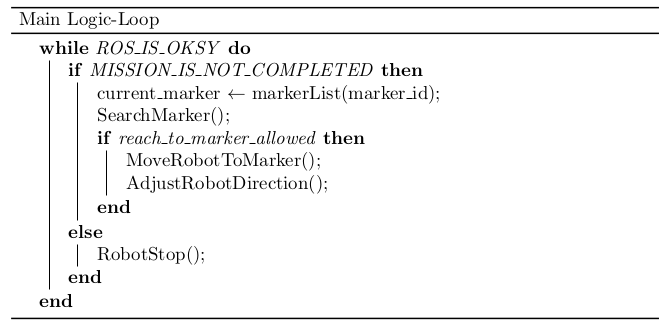
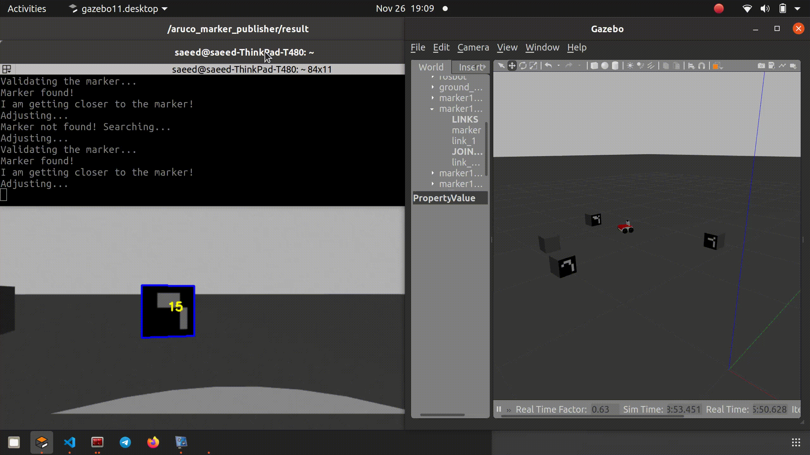

# Exprimental Robotics Course-Assignmet 1

This marks the inaugural assignment of the Experimental Robotics course in the Robotics Engineering program at the University of Genoa. The primary objectives of this assignment include acquiring fundamental knowledge of robot geometric modeling using URDF, utilizing various sensors and plugins for simulating the robot in the Gazebo environment, grasping the basics of task image processing with OpenCV, incorporating external packages such as ArUco into our project, understanding the fundamentals of task planning, implementing behavior-based algorithms for a robot, and engaging in practical sessions to work with the real robot, Rosbot2.

## Table of Contents

1. [Assignment Description](#Assignment-Description)
2. [PART 1-The Implemented Algorithm](#PART-1-The-Implemented-Algorithm)
    - [1-The Search Behaviour](#1-The-Search-Behaviour)
    - [2-The Move to the Marker Behavior](#2-The-Move-to-the-Marker-Behavior)
    - [3-The Adjusting w.r to the Marker Behavior](#3-The-Adjusting-w.r-to-the-Marker-Behavior)

3. [PART 2-The Code Implementation (C++)](#PART-2-The-Code-Implementation-(C++))
    - [1-ROBOT LOGIC NODE](#1-ROBOT-LOGIC-NODE)
    - [2-ArUco MARKER PUBLISHER NODE](#2-ArUco-MARKER-PUBLISHER-NODE)
    - [3-Custom Message](#3-Custom-Message)

4. [PART 3-The Robot Description, Gazebo Plugins, and Sensors](#PART-3-The-Robot-Description,-Gazebo-Plugins,-and-Sensors)
5. [PART 4-The Gazebo Simulation](#PART-4-The-Gazebo-Simulation)
    - [Step 1-Prerequisite and Packages](#Step-1-Prerequisite-and-Packages)
    - [Step 2-How to Run the Simulation](#Step-2-How-to-Run-the-Simulation)
6. [PART 5-The Real Implementation on Rosbot2 Robot](#PART-5-The-Real-Implementation-on-Rosbot2-Robot)
    - [Step 1-Running the Robot Sensors Drivers](#Step-1-Running-the-Robot-Sensors-Drivers)
    - [Step 2-Testing Different Types of Sensors](#Step-2-Testing-Different-Types-of-Sensors)
    - [Step 3-Evaluating the Performance of the ArUco Algorithm](#Step-3-Evaluating-the-Performance-of-the-ArUco-Algorithm)
    - [Step 4-Debugging Our Algorithm and Code](#Step-4-Debugging-Our-Algorithm-and-Code)
    - [Step 5-Final Test](#Step-5-Final-Test)
7. [PART 6-Suggestions for Improvment](#PART-6-The-Suggestion-for-Improvment)
8. [Group Members](#Group-Members)
9. [License](#License)

<a name="Assignment-Description"></a>
## Assignment Description

The Rosbot2 robot is tasked with accomplishing its mission, which involves locating a sequence of markers within the environment.

<p align="center">

</p>

Each marker contains a distinct QR code, encoding the subsequent instruction for the robot:

- Marker 11 -> rotate until you find marker 12; then reach marker 12,
- Marker 12 -> rotate until you find marker 13; then reach marker 13,
- Marker 13 -> rotate until you find marker 15; then reach marker 15,
- Marker 15 -> Mission Competed!

<a name="PART-1-The-Implemented-Algorithm"></a>
## PART 1-The Implemented Algorithm

We designed a behavior-based algorithm to assist the Rosbot2 in fulfilling its mission. The following images depict the pseudo-code of our algorithm:
<p align="center">

</p>

<a name="1-The-Search-Behaviour"></a>
### 1-The Search Behaviour:

The robot undergoes rotation to identify the next marker by inspecting marker IDs in the camera feed.

<p align="center">
   
</p>

<a name="2-The-Move-to-the-Marker-Behavior"></a>
### 2-The Move to the Marker Behavior:

Upon successful validation, the robot navigates towards the marker by adjusting its linear speeds.

<p align="center">
  
</p>

<a name="3-The-Adjusting-w.r-to-the-Marker-Behavior"></a>
### 3-The Adjusting w.r to the Marker Behavior:

The robot fine-tunes its orientation to align with the marker, enhancing overall accuracy.

<p align="center">
  
</p>

<a name="PART-2-The-Code-Implementation-(C++)"></a>
## PART 2-The Code Implementation (C++) 

The image below illustrates the rqt graph of the robot's software, displaying all active nodes and topics throughout the simulation.

<p align="center">

</p>

<a name="1-ROBOT-LOGIC-NODE"></a>
- **1- ROBOT LOGIC NODE:**

This ROS node implements logic for a mobile robot to navigate through markers by utilizing marker information received from the /marker_info topic. The robot's objective is to identify specific markers, move towards them, and align its orientation to match the markers.

### Functionality

`-RobotStop():` Assign a linear velocity of zero to the robot.

`-RobotTurn():` Assign an angular velocity to the robot.

`-RobotMoveForward():` Assign a linear velocity to the robot.

`-RobotSpeedUp():` Control the robot's linear velocity.

`-RobotSpeedDown():` Control the robot's linear velocity.

`-SearchMarker():` The robot undergoes rotation to identify the next marker by inspecting marker IDs in the camera feed.

`-validateMarker():` Verify whether the detected marker is within the expected list of markers.

`-MoveRobotToMarker():` Upon successful validation, the robot navigates towards the marker by adjusting its linear speeds.

`-AdjustRobotDirection():` The robot fine-tunes its orientation to align with the marker, enhancing overall accuracy.

`-markerInfoCallback():` Refresh the information pertaining to the detected marker.

<a name="2-ArUco-MARKER-PUBLISHER-NODE"></a>
- **2- ArUco MARKER PUBLISHER NODE:**

The ArUco Marker Publisher Node is tasked with identifying ArUco markers in incoming camera images and disseminating marker information to the /marker_info topic. This node enhances the robot logic by offering real-time marker detection and pertinent marker data.

### Functionality

`-image_callback():` Receive the camera image from the Gazebo environment and employ the ArUco detector to process it, extracting information such as the marker's ID and size.

<a name="3-Custom-Message"></a>
- **3- Custom Message:**

`exp_assignment1::MarkerInfo:` This message includes crucial information such as the marker ID, marker size, x and y coordinates of the detected marker in the image, as well as the width and height of the image captured by the sensor. This data is essential for the robot logic node to effectively navigate and interact with specific markers in its environment.

<a name="PART-3-The-Robot-Description,-Gazebo-Plugins,-and-Sensors"></a>
## PART 3-The Robot Description, Gazebo Plugins, and Sensors

For additional practice in robot modeling, we have modified the original model by eliminating the Kinect and laser scanner sensors. Instead, we have opted for a simplified approach, incorporating only a basic camera as the vision sensor for the robot.

<p align="center">

</p>

The URDF folder encompasses all the necessary files that define the geometric model of the robot, along with Gazebo plugins and the specifications for the robot's sensors.

### /src/exp_assignment1/urdf/

- **rosbot.xacro file:** defines the geometric model of the robot.

- **materials.xacro file:** Specifies the materials utilized in the Gazebo simulation..

- **rosbot.gazebo file:** Defines the Gazebo plugins and the specifications for the robot's sensors.

<a name="PART-4-The-Gazebo-Simulation"></a>
## PART 4-The Gazebo Simulation

<a name="Step-1-Prerequisite-and-Packages"></a>
### Step 1-Prerequisite and Packages:
- ROS Noetic /ROS2 installed
- vision_opencv
- aruco_ros (https://github.com/CarmineD8/aruco_ros) (https://github.com/pal-robotics/aruco_ros/tree/melodic-devel)
- robot_urdf (https://github.com/CarmineD8/robot_urdf)

<a name="Step-2-How-to-Run-the-Simulation"></a>
### Step 2-How to Run the Simulation:

Initially, execute the rosbot_gazebo.launch file to initialize the ROS nodes, Gazebo simulator, and RViz visualization tools:

``` bash
 roslaunch exp_assignment1 rosbot_gazebo.launch
```
In another terminal:
This command starts the ArUco marker publisher node to identify markers in the Gazebo environment, captured by the robot's camera:

``` bash
rosrun exp_assignment1 marker_publisher /image:=/rrbot/camera1/image_raw
```
In another terminal:
This command utilizes the image_view package to display the markers detected by the ArUco package in a separate window:

``` bash
rosrun image_view image_view image:=/aruco_marker_publisher/result
```
In another terminal:
This command executes the robot's logic node, which contains our suggested algorithm:
``` bash
rosrun exp_assignment1 robot_logic
```

<p align="center">
 </a>
</p>

<a name="PART-5-The-Real-Implementation-on-Rosbot2-Robot"></a>
## PART 5-The Real Implementation on Rosbot2 Robot

We conducted practical experiments with our suggested algorithms on the Rosbot2 robot, involving various steps. These steps included running the robot sensors drivers, testing different types of sensors such as the RGBD camera, and evaluating the performance of the ArUco algorithms in diverse scenarios. The experience proved to be highly valuable for our team.

<p align="center">
    
</p>

<a name="Step-1-Running-the-Robot-Sensors-Drivers"></a>
### Step 1-Running the Robot Sensors Drivers:

``` bash
 roslaunch tutorial_pkgall.launch
```

<a name="Step-2-Testing-Different-Types-of-Sensors"></a>
### Step 2-Testing Different Types of Sensors:

We sought to assess our knowledge and understanding of handling real data using tools like RViz, an excellent visualization tool in ROS. Our testing involved the examination of RGB data from the camera, as well as the depth image from the infrared sensor of the Kinect.

<p align="center">
 
</p>

<a name="Step-3-Evaluating-the-Performance-of-the-ArUco-Algorithm"></a>
### Step 3-Evaluating the Performance of the ArUco Algorithm:

We aim to challenge the performance of the ArUco marker detection algorithms in various scenarios. This involves rotating the marker, adjusting the distance of the marker from close to far to assess the acceptable working range of the ArUco detector, and moving the marker to evaluate the performance of ArUco in detecting a moving marker.

<p align="center">
 </a>
</p>

<a name="Step-4-Debugging-Our-Algorithm-and-Code"></a>
### Step 4-Debugging Our Algorithm and the Code Implementation:

In a real implementation, we have the opportunity to debug our algorithms and calibrate code parameters according to real-world scenarios. For instance, we can fine-tune parameters like the size threshold that determines the proximity of the robot to the marker, the acceptable rotation speed during the search behavior to prevent the ArUco detector from missing the marker due to rapid rotation, and determining the safe linear speed of the robot within the lab environment, among other considerations.

<p align="center">
 </a>
</p>

<a name="Step-5-Final-Test"></a>
### Step 5-Final Test:

After successfully completing all the preceding steps, we conducted the final test of our algorithms. The Rosbot2 robot navigated smoothly in the environment, exhibiting the expected behaviors based on our algorithms. The robot successfully accomplished its task.

 Video
=============
▶ Click to watch the video:
[](https://youtu.be/gFV2UVKJbjI "real test")

<a name="PART-6-The-Suggestion-for-Improvment"></a>
## PART 6-Suggestions for Improvment

  - **Enhance the Search Strategy:** To address situations where the ArUco marker is lost due to its limitations, consider implementing a probabilistic model. This model can predict the potential location of the marker based on the previous direction and detected markers, enhancing the robustness of the search strategy.

  - **Upgrade High-Level Logic:** Integrate a task planner algorithm to manage ongoing tasks effectively. Additionally, implement a path planner to suggest optimal waypoints for the robot, enhancing its navigation efficiency between markers.

  - **Enhance Vision Algorithms:** Instead of relying solely on the ArUco marker detector, leverage features provided by the OpenCV library to improve marker detection. For instance, incorporating a shape detector to identify the rectangular shape of the detected marker can serve as a backup if the ArUco marker detection fails, allowing for continued tracking based on shape information.

<a name="Group-Members"></a>
## Group Members: 

**Robotics Engineering, University of Genoa, Italy**
- Saeed Abdollahi 🆔 ([@Saeed](https://github.com/SaeidAbdollahi)) 
- Parinaz Ramezanpour 🆔 ([@ParinazRmp](https://github.com/ParinazRmp))
- Danial Sabzevari 🆔 ([@dssdanial](https://github.com/dssdanial)) 
- Amir Rad 🆔 ([@AmirRad1998](https://github.com/AmirRad1998)) 
- Ehsan Fatemi 🆔 ([@ehsan51](https://github.com/ehsan51)) 

<a name="License"></a>
## License
This project is licensed under the MIT License - see the LICENSE file for details.
